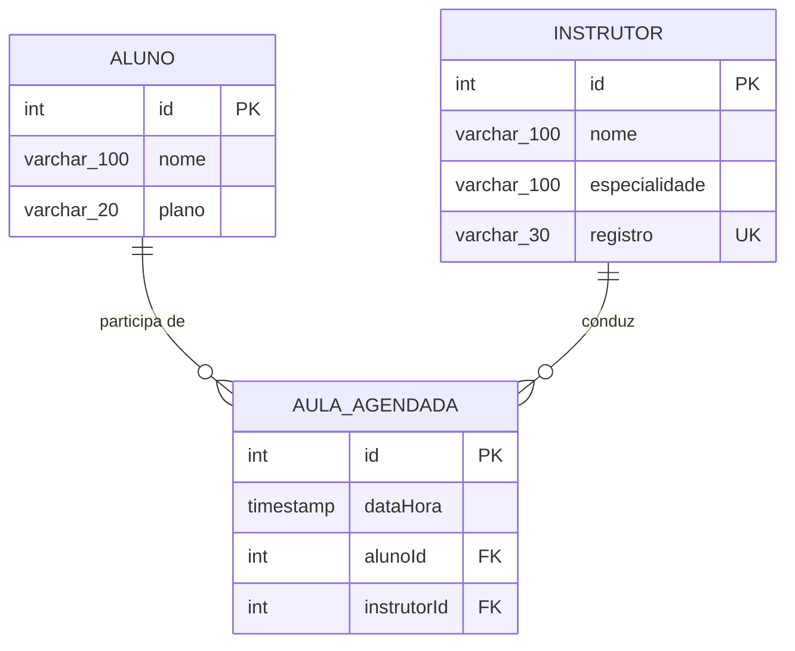

# Exercício de fixação: um fluxo de ponta a ponta

> Prática livre, sem nota. A ideia é você repetir sozinho o caminho completo que fizemos
> em aula, do modelo no papel até a resposta em JSON. Na próxima aula conversamos sobre o
> que travou.

---

## O que é este exercício

Você já viu cada peça separada: entidade, repositório, rota do Express, banco respondendo.
O que costuma faltar é a prática de montar tudo isso de uma vez, do zero, sem ninguém
ditando a ordem.

É isso aqui. Você recebe a modelagem do banco pronta, em diagrama, e constrói o resto:
as entidades, as rotas e o caminho que liga uma requisição HTTP até o PostgreSQL e de
volta.

O foco não é acertar o desenho do banco (ele já vem resolvido), é acumular prática
escrevendo o código que liga as camadas.

---

## Escolha o domínio

O diagrama abaixo é de uma **academia**, e é uma sugestão. Se você preferir praticar em
cima de outro assunto, use o que quiser, inclusive a **biblioteca** do módulo passado, que
tem exatamente a mesma estrutura:

| Academia | Biblioteca | Papel na estrutura |
|---|---|---|
| `Aluno` | `Leitor` | uma das pontas |
| `Instrutor` | `Livro` | a outra ponta |
| `AulaAgendada` | `Emprestimo` | a tabela do meio, que liga as duas e tem data própria |

O que importa é manter **a forma**: duas entidades independentes e uma terceira no meio,
ligando as duas, com um atributo próprio de data e hora. Se trocar de domínio, redesenhe o
diagrama antes de programar.

---

## A modelagem, já resolvida



Em uma linha, a mesma informação:

```
Aluno (1) ──── (N) AulaAgendada (N) ──── (1) Instrutor
```

Como ler o diagrama:

- `PK` é chave primária, `FK` é chave estrangeira, `UK` é restrição de valor único. O
  `registro` do instrutor não pode repetir.
- `varchar_100` no diagrama significa `varchar(100)` no banco. A ferramenta que desenha o
  diagrama não aceita parênteses no tipo, então o tamanho vem depois do sublinhado.
- `plano` guarda um valor entre `mensal`, `trimestral`, `semestral` e `anual`.
- As duas chaves estrangeiras ficam em `AULA_AGENDADA`, do lado N. Vale confirmar no
  diagrama antes de escrever os decorators, porque é aí que a maioria dos erros aparece.
- `AulaAgendada` existe como tabela própria porque tem dado só dela, a data e hora, e
  porque liga duas entidades diferentes.

---

## O que construir

### 1. As entidades

Três classes com os decorators do TypeORM, traduzindo o diagrama. O relacionamento precisa
dos dois lados declarados: `@ManyToOne` em `AulaAgendada`, e o `@OneToMany` inverso nas
outras duas.

Sobre criar as tabelas no banco: para uma prática local, deixar o `synchronize: true`
cuidar disso é suficiente, o banco aqui é descartável. Se quiser treinar migrations
também, aproveite, mas não é o objetivo deste exercício.

### 2. As rotas

Um CRUD para cada entidade, salvando e lendo do PostgreSQL pelos repositórios:

| Verbo | Rota | O que responder |
|---|---|---|
| `GET` | `/alunos` | `200` com a lista |
| `GET` | `/alunos/:id` | `200` com o registro, ou `404` se não achar |
| `POST` | `/alunos` | `201` com o que foi criado, ou `400` se faltar campo |
| `PUT` | `/alunos/:id` | `200` com o registro atualizado, ou `404` |
| `DELETE` | `/alunos/:id` | `204` sem corpo, ou `404` |

Repita para `/instrutores` e `/aulas-agendadas`.

Em `GET /aulas-agendadas`, use `relations` para trazer o aluno e o instrutor aninhados no
JSON. Sem isso, a resposta vem só com os ids.

### 3. O fluxo fechando

"Ponta a ponta" quer dizer conseguir seguir com o dedo todo o caminho:

```
requisição HTTP  ->  rota do Express  ->  repositório do TypeORM
                                                   |
                                                  SQL
                                                   |
                                              PostgreSQL
                                                   |
                     resposta JSON  <-  objeto  <--+
```

O teste de que fechou: cadastre uma aula agendada pela API, confirme a linha no `psql`,
**reinicie o servidor** e busque de novo pela API. Se o dado continua lá, o fluxo está
completo.

---

## Se quiser esticar

Nada disso é necessário, é só para quem terminar e quiser continuar praticando:

- Filtrar as aulas de um instrutor específico por query string.
- Impedir o cadastro de duas aulas do mesmo instrutor no mesmo horário. Pense em como
  detectar isso antes de inserir.
- Listar cada aluno com a contagem de aulas que ele tem agendadas.

Os dois últimos ficam bem mais confortáveis depois das Aulas 8 e 9. Se travar, é normal,
guarde a dúvida.

---

## Quando algo não funcionar

| Sintoma | Onde olhar |
|---|---|
| `relation "instrutor" does not exist` | A tabela não foi criada. Confira se a entidade está registrada em `entities`. |
| Erro de compilação na arrow function do `@ManyToOne` | Falta o `@OneToMany` inverso na outra entidade. |
| Chave estrangeira apareceu na tabela errada | O `@ManyToOne` foi para o lado 1. Ele mora sempre no lado N. |
| `aula.aluno` vem `undefined` | Falta `relations` na consulta. |
| A requisição fica pendurada, sem resposta | Falta `await`, ou algum caminho do `if` não responde nada. |
| `ECONNREFUSED` na porta 5432 | O banco não está de pé. Confira o contêiner. |

Se o PostgreSQL local der problema, use o contêiner Docker que passamos em aula. Não fique
sem praticar por causa de ambiente, me procure antes.

---

## Para a próxima aula

Traga o projeto rodando, ou traga onde travou. As duas coisas servem, e a segunda
geralmente rende conversa melhor.

Duas perguntas para você tentar responder sozinho antes da Aula 8, olhando o código que
escreveu:

1. Quantas vezes você repetiu o mesmo `try/catch` nas suas rotas?
2. Se a academia trocasse o TypeORM por outra biblioteca no ano que vem, quantos arquivos
   seus precisariam mudar?

Não precisa resolver nada agora. As duas viram assunto na próxima aula.
